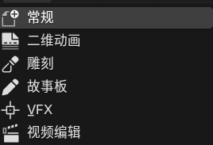
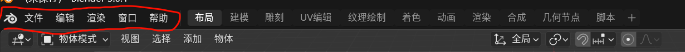
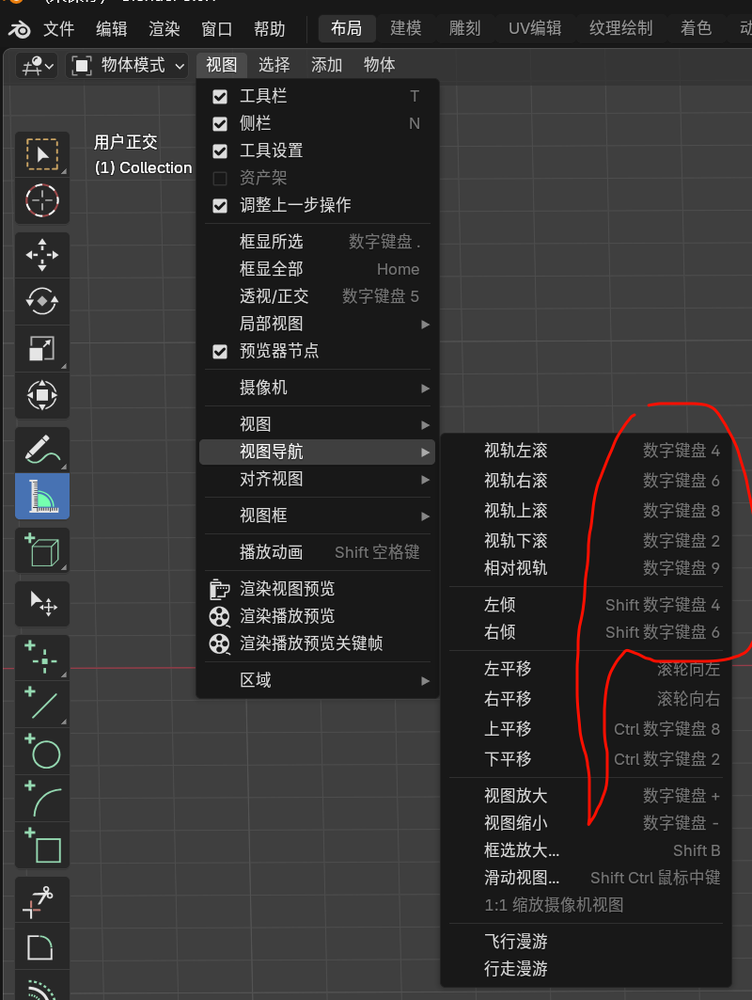
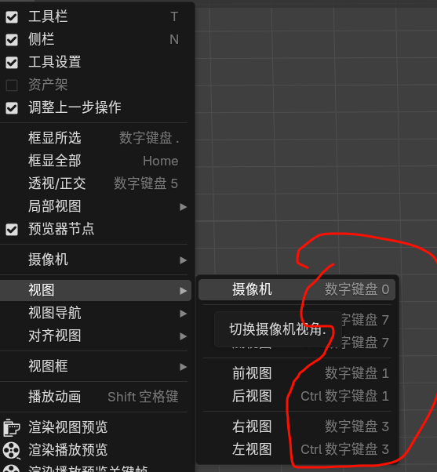
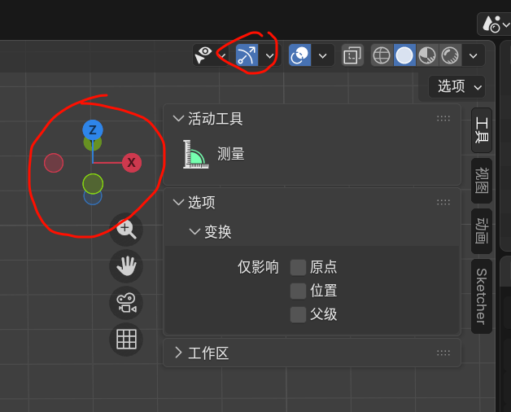
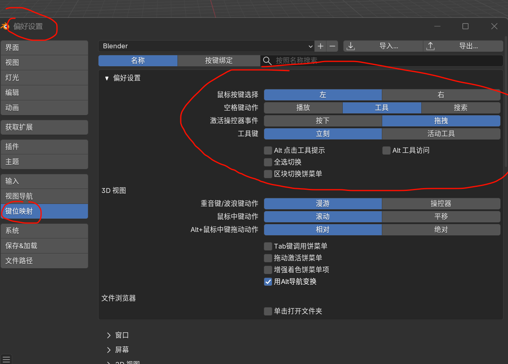
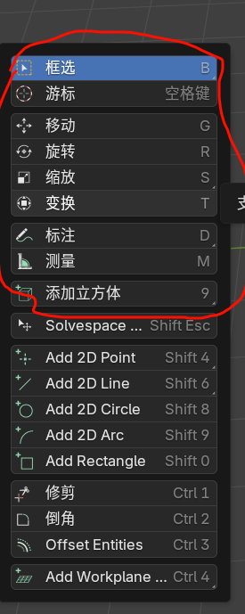
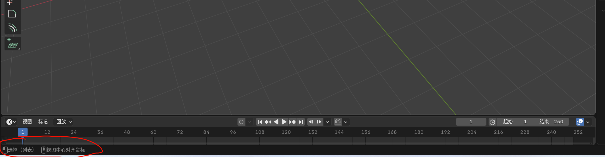
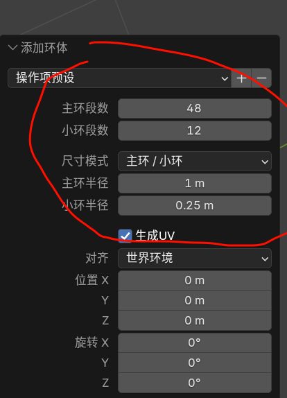
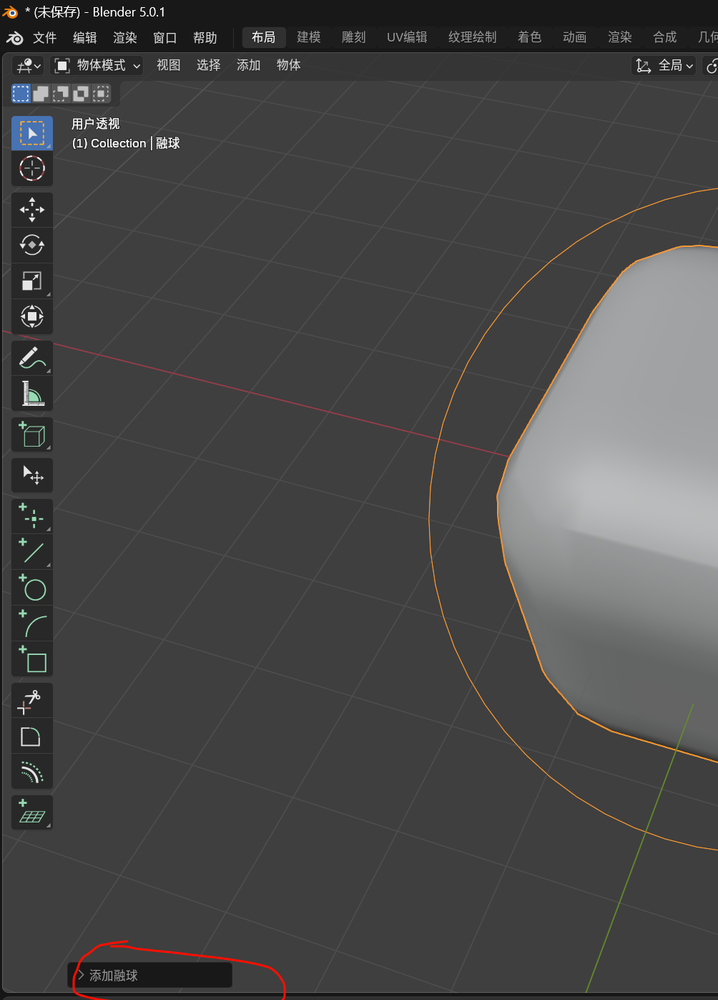

#### why blender
 我个人对于开源的追求+丰富的插件系统希望可以一站式解决所有建模问题 

邪门 居然能新建这么多东西

故事版（Storyboard） = 视频 / 动画 / 电影的 连环画分镜脚本。

vfx Visual Effects 视觉特效   

基础的就这几个 后面的都是面板

我这种不熟悉小键盘的 还是打开移动工具吧

我的默认设置 这个可以参考

这几个快捷键挺实用的

F9 需要记录下功能
小键盘的.号按键（句号）

居然给提示好评

上一步操作面板

shift+鼠标中建 移动
鼠标中建 旋转视角

blender 添加的物体都是多面体 是离散的 简单来说就是用非常细的多面体模拟连续物体

表面细分

比较不舒服的地方 就是创建圆环一定要提前设置好参数 有些参数后期没法修改 比如
 这块没法修改

blender新建多边形有个不舒服的地方 就是需要创建物体+F9 

上一步操作面板

添加修改器的时候 一定不要直接选择确定那个符号 如果选了对号 相当于修改原始网格 相当于实时渲染 如果你点了确定 就会破坏性的修改到模型里面去

表面细分修改器

Ctrl+R 环切并滑移
i 内插面（面操作）

#####hardops boxcutter

挤出操作

1.算机如何显示物体
2.各种坐标系
3.建模方式 搭积木（参数化建模） blender（多边形建模）